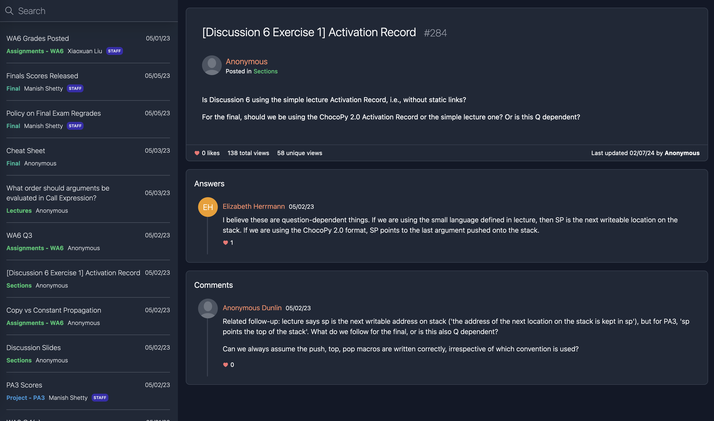

[](https://choosealicense.com/licenses/gpl-3.0/)

EdBox is an archiver for Ed courses. Save posts and file attachments from
Ed and generate static sites for local viewing!

Built with Python and Alpine.js + Tailwind.



## Features

- Archives course info and posts to json files
- Downloads file attachments and user profile photos
- Generates an offline, searchable webpage for each archived course
- Webpages display Ed's formatting options and math notations (LaTeX)
- Anonymous usernames are correctly generated (matches what's shown on Ed)
- Color-coded post categories and user profiles

## Installation

```sh
python3 -m venv venv
source ./venv/bin/activate
pip install -r requirements.txt
```

## Usage

- Generate an Ed API token [here](https://edstem.org/us/settings/api-tokens).
- Save `ED_API_TOKEN=YOUR_API_TOKEN_HERE` to a `.env` file (see `.env.template`).
- Run `python3 edbox.py` and choose Ed courses to archive.

If EdBox fails due to network errors or is otherwise interrupted while
archiving, restart the program and it will pick up where it left off.

## Development

There is no need to manually build or install dev dependencies for the webpage
unless you are making changes to it.

1. Install development dependencies:

```sh
cd web
pnpm install
```

2. Add assets downloaded by edbox.py to `web/build/assets`.
3. Build the site using `pnpm run build`. This generates the `index.html` file
   and rebuilds the `web/static/tailwind.css` file.
4. Open `web/build/index.html` to view your changes.

## Acknowledgements
- [smartspot2's Ed API](https://github.com/smartspot2/edapi)
